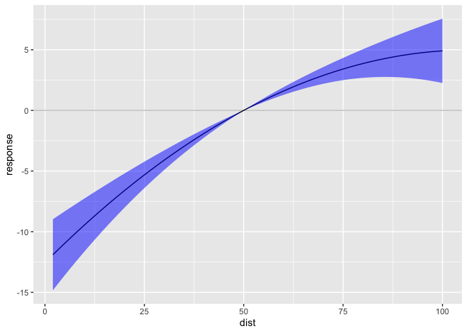

<!-- README.md is generated from README.Rmd. Please edit that file -->

# useful

This package is for helper functions I end up using all the time.

Its under heavy development at the moment - so probably best to chat to
me if you want to use anything.

Things in this package are for:

- Plotting temperature and precipitation response functions from
  `fixest` regression output

## Installation

You can install the development version of useful from
[GitHub](https://github.com/) with:

``` r
# install.packages("devtools")
devtools::install_github("TomBearpark/useful")
```

## Example

This is a basic example which shows you how to solve a common problem:

``` r

library(useful)
library(fixest)

df <- cars

df$dist1 <- df$dist
df$dist2 <- df$dist^2

m  <- fixest::feols(speed ~ dist1 + dist2, data = df)
rf <- useful::predict_poly(m, "dist", min = 2, max = 100, ref = 50, 
                           xvar_name = "dist")
useful::plot_rf_poly(rf, xvar = "dist")
```


